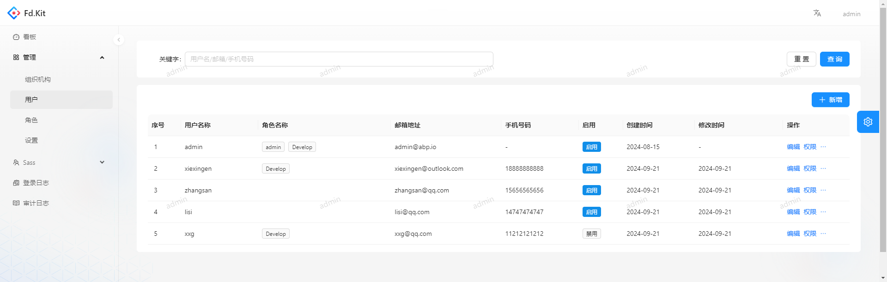
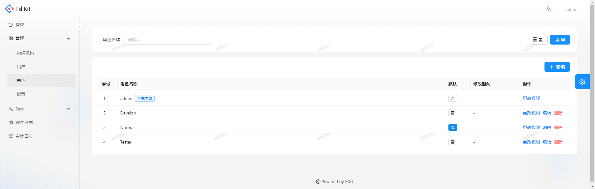
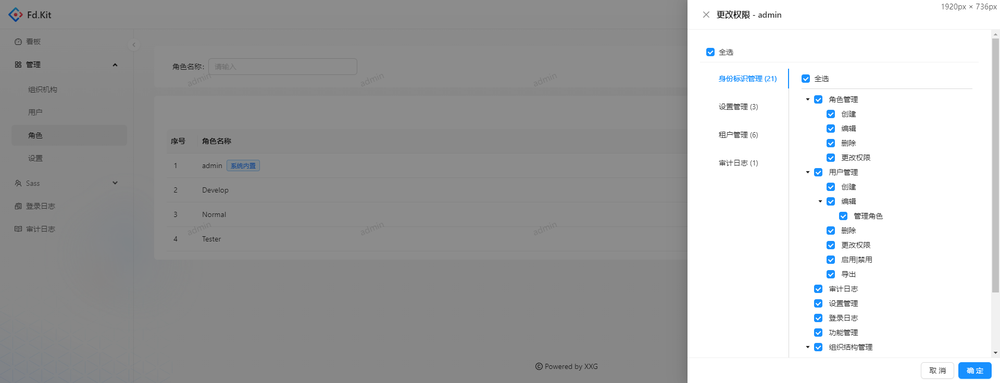
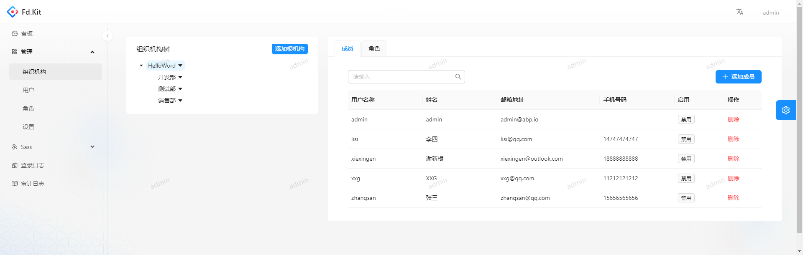
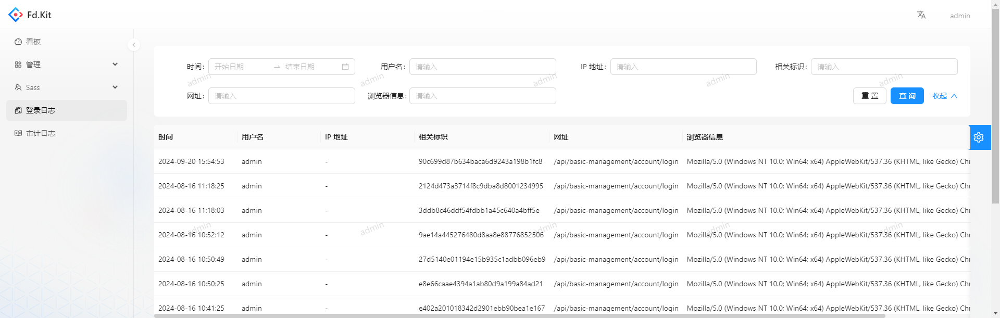
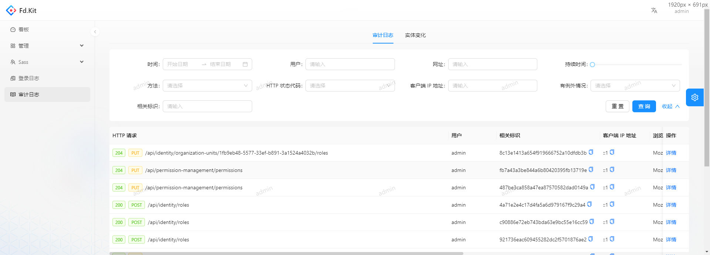
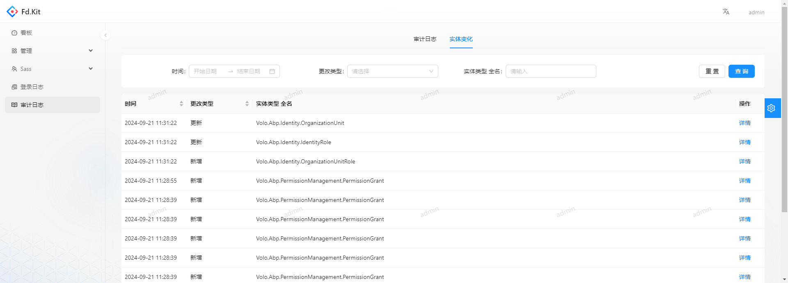

Fd.Kit

后端基于 基于.net8.x 、abp 8.x 版本
前端基于 react@18.x、umi@4.x、antd@5.x

## 📦 快速开始

用户名/密码 admin/1q2w3E\*

## ✨ 系统功能

- [x] 用户管理
- [x] 角色管理
- [x] 审计日志
- [x] 多语言
- [x] Setting 管理
- [x] 多租户
- [x] 容器化部署
- [ ] 文件管理
- [ ] 数据字典
- [ ] 定时任务管理

## 速览

用户管理

角色管理

组织管理

登录日志

审计日志

## 🤝 如何贡献

非常欢迎你的加入！提一个 Issue 或者提交一个 Pull Request。

**Pull Request:**

1. Fork 代码!
2. 创建自己的分支: `git checkout -b feat/xxxx`
3. 提交你的修改: `git commit -am 'feat(function): add xxxxx'`
4. 推送您的分支: `git push origin feat/xxxx`
5. 提交`pull request`

## Git 贡献提交规范

- 参考
  - `feat` 增加新功能
  - `fix` 修复问题/BUG
  - `style` 代码风格相关无影响运行结果的
  - `perf` 优化/性能提升
  - `refactor` 重构
  - `revert` 撤销修改
  - `test` 测试相关
  - `docs` 文档/注释
  - `chore` 依赖更新/脚手架配置修改等
  - `workflow` 工作流改进
  - `ci` 持续集成
  - `types` 类型定义文件更改
  - `wip` 开发中
